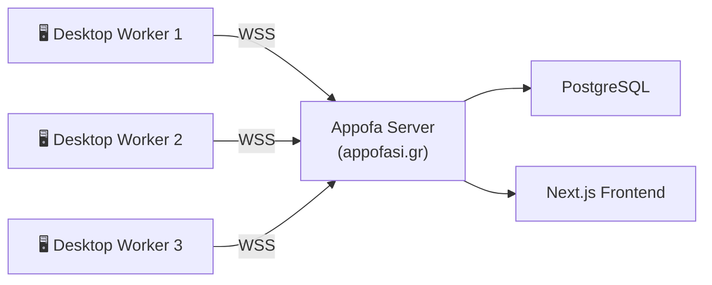

# Appofasistis — Appofa Desktop Worker

**Desktop worker node for [Appofa](https://github.com/Antoniskp/Appofa) — offloads server tasks to volunteer PCs**


---

## What is this?

Appofasistis is a standalone Node.js application that runs on your desktop and helps the [Appofa](https://appofasi.gr) platform by volunteering your computer's resources to handle tasks that would otherwise burden the server.

It connects to the Appofa server via WebSocket, receives work (like link previews, poll stats, leaderboard calculations), processes it locally, and sends results back — reducing the need for expensive server infrastructure.

## Architecture



## Download

### Option 1 — Download ZIP (no Git required)

1. Go to the [GitHub repository](https://github.com/Antoniskp/Appofasistis).
2. Click the green **"<> Code"** button → **"Download ZIP"**.
3. Extract the ZIP to a folder of your choice.

### Option 2 — Clone with Git

```bash
git clone https://github.com/Antoniskp/Appofasistis.git
```

> **Note:** Both options give you the same files. Use whichever you're more comfortable with.

## Quick Start

```bash
cd Appofasistis        # navigate to the cloned repo or extracted ZIP folder
npm install
cp .env.example .env   # edit with your server URL + worker token
npm start
```

## Windows Easy Install

No command line needed — just double-click!

1. **Double-click `install.bat`** — checks Node.js, installs dependencies, and creates `.env` for you.
2. **Edit `.env`** with Notepad — fill in your `SERVER_URL` and `WORKER_TOKEN` (get the token from the Appofa admin panel).
3. **Double-click `start.bat`** — launches the worker. A window will open showing live log output.

> **First time?** You'll need [Node.js 18+](https://nodejs.org) installed. `install.bat` will tell you if it's missing.

## Configuration

Copy `.env.example` to `.env` and set the following variables:

| Variable | Required | Default | Description |
|---|---|---|---|
| `SERVER_URL` | ✅ | — | WebSocket URL of the Appofa server (e.g. `wss://appofasi.gr/ws/workers`) |
| `WORKER_TOKEN` | ✅ | — | Authentication token obtained from the Appofa admin panel |
| `WORKER_NAME` | | `unnamed-worker` | Human-readable name shown in the admin dashboard |
| `MAX_CONCURRENT_TASKS` | | `3` | How many tasks to process simultaneously |
| `HEARTBEAT_INTERVAL` | | `10000` | How often (ms) to send a heartbeat to the server |
| `RECONNECT_DELAY` | | `5000` | Base delay (ms) before reconnecting after a disconnect |
| `LOG_LEVEL` | | `info` | Log verbosity: `debug` \| `info` \| `warn` \| `error` |

## File Structure

```
├── package.json
├── .env.example
├── .gitignore
├── README.md
├── LICENSE
└── src/
    ├── index.js          # Entry point — bootstraps everything
    ├── connection.js     # WebSocket connection, reconnect, exponential backoff
    ├── heartbeat.js      # Periodic CPU/memory reporting to server
    ├── taskRunner.js     # Receives tasks, routes to handlers, sends results
    ├── logger.js         # Timestamped logger with emoji prefixes
    ├── config.js         # Loads .env, validates required config
    └── tasks/
        ├── index.js      # Task registry — maps task type strings to handlers
        ├── linkPreview.js   # Fetches URL, parses OpenGraph meta tags
        ├── pollStats.js     # Aggregates votes into counts and percentages
        ├── leaderboard.js   # Sorts and ranks scores, returns top N
        └── textAnalysis.js  # Word count, reading time, keyword extraction
```

## Supported Task Types

### `linkPreview`
Fetches a URL and extracts OpenGraph/meta preview data.

**Payload:** `{ url: string }`

**Result:** `{ url, title, description, image, siteName }`

---

### `pollStats`
Aggregates an array of votes into counts and percentages.

**Payload:** `{ votes: number[], options?: string[] }`

**Result:** `{ total: number, results: [{ option, votes, percentage }] }`

---

### `leaderboard`
Sorts and ranks an array of score entries, returning the top N.

**Payload:** `{ scores: [{ id, name, score }], topN?: number }`

**Result:** `{ ranked: [{ rank, id, name, score }] }`

---

### `textAnalysis`
Analyses text for word count, reading time, and top keywords.

**Payload:** `{ text: string, topKeywords?: number }`

**Result:** `{ wordCount, readingTimeMinutes, keywords: [{ word, count }] }`

## WebSocket Protocol

All messages are JSON objects. The worker:

1. **Registers** on connection open:
   ```json
   { "type": "register", "name": "my-desktop", "capabilities": ["linkPreview", "pollStats", "leaderboard", "textAnalysis"], "maxConcurrentTasks": 3 }
   ```

2. **Receives tasks** from the server:
   ```json
   { "type": "task", "taskId": "abc123", "taskType": "linkPreview", "payload": { "url": "https://example.com" } }
   ```

3. **Sends results** back:
   ```json
   { "type": "taskResult", "taskId": "abc123", "status": "success", "result": { ... } }
   ```

4. **Sends heartbeats** periodically:
   ```json
   { "type": "heartbeat", "load": 0.5, "memory": { "used": 512, "total": 8192, "usedMB": 512, "totalMB": 8192 }, "activeTasks": 1 }
   ```

## Development

```bash
npm run dev   # starts with Node.js built-in watch (Node 18+)
```

## License

Copyright (c) 2026 Antoniskp. All Rights Reserved.
