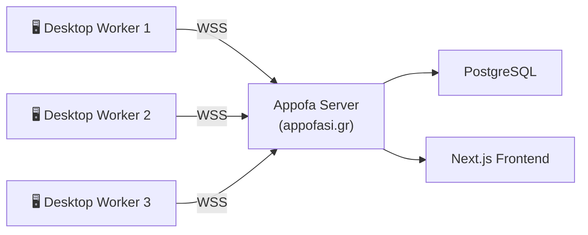

# Appofasistis — Appofa Desktop Worker

**Desktop worker node for [Appofa](https://github.com/Antoniskp/Appofa) — offloads server tasks to volunteer PCs**


---

## What is this?

Appofasistis is a standalone Node.js application that runs on your desktop and helps the [Appofa](https://appofasi.gr) platform by volunteering your computer's resources to handle tasks that would otherwise burden the server.

It connects to the Appofa server via WebSocket, receives work (like link previews, poll stats, leaderboard calculations), processes it locally, and sends results back — reducing the need for expensive server infrastructure.

## Architecture



## Quick Start

```bash
git clone https://github.com/Antoniskp/Appofasistis.git
cd Appofasistis
npm install
cp .env.example .env   # edit with your server URL + worker token
npm start
```

## Status

🚧 Under development — full implementation coming soon.

## License

Copyright (c) 2026 Antoniskp. All Rights Reserved.
