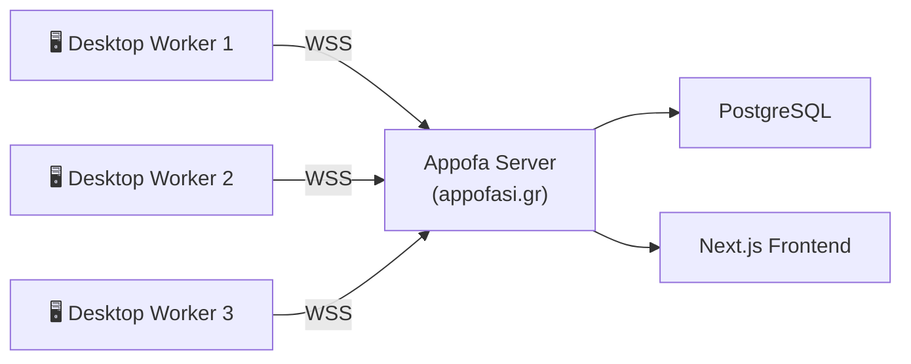

# Appofasistis — Appofa Desktop Worker

**Desktop worker node for [Appofa](https://github.com/Antoniskp/Appofa) — offloads server tasks to volunteer PCs**


[](https://github.com/Antoniskp/Appofasistis/actions/workflows/ci.yml)

---

## What is this?

Appofasistis is a standalone Node.js application that runs on your desktop and helps the [Appofa](https://appofasi.gr) platform by volunteering your computer's resources to handle tasks that would otherwise burden the server.

It connects to the Appofa server via WebSocket, receives work (like link previews, poll stats, leaderboard calculations), processes it locally, and sends results back — reducing the need for expensive server infrastructure.

## Architecture



## Download

### Option 1 — Download ZIP (no Git required)

1. Go to the [GitHub repository](https://github.com/Antoniskp/Appofasistis).
2. Click the green **"<> Code"** button → **"Download ZIP"**.
3. Extract the ZIP to a folder of your choice.

### Option 2 — Clone with Git

```bash
git clone https://github.com/Antoniskp/Appofasistis.git
```

> **Note:** Both options give you the same files. Use whichever you're more comfortable with.

## Quick Start

```bash
cd Appofasistis        # navigate to the cloned repo or extracted ZIP folder
npm install
cp .env.example .env   # edit with your server URL + worker token
npm start
```

## Windows Easy Install

No command line needed — just double-click!

1. **Double-click `install.bat`** — checks Node.js, installs dependencies, and creates `.env` for you.
2. **Edit `.env`** with Notepad — fill in your `SERVER_URL` and `WORKER_TOKEN` (get the token from the Appofa admin panel).
3. **Double-click `start.bat`** — launches the worker. A window will open showing live log output.

> **First time?** You'll need [Node.js 18+](https://nodejs.org) installed. `install.bat` will tell you if it's missing.

## Configuration

Copy `.env.example` to `.env` and set the following variables:

| Variable | Required | Default | Description |
|---|---|---|---|
| `SERVER_URL` | ✅ | — | WebSocket URL of the Appofa server (e.g. `wss://appofasi.gr/ws/workers`) |
| `WORKER_TOKEN` | ✅ | — | Authentication token obtained from the Appofa admin panel |
| `WORKER_NAME` | | `unnamed-worker` | Human-readable name shown in the admin dashboard |
| `MAX_CONCURRENT_TASKS` | | `3` | How many tasks to process simultaneously |
| `HEARTBEAT_INTERVAL` | | `10000` | How often (ms) to send a heartbeat to the server |
| `RECONNECT_DELAY` | | `5000` | Base delay (ms) before reconnecting after a disconnect |
| `LOG_LEVEL` | | `info` | Log verbosity: `debug` \| `info` \| `warn` \| `error` |

## File Structure

```
├── package.json
├── .env.example
├── .gitignore
├── README.md
├── LICENSE
├── install.bat               # Windows one-click setup
├── start.bat                 # Windows one-click start
├── .github/
│   └── workflows/
│       └── ci.yml            # GitHub Actions CI (Node 18/20/22)
├── src/
│   ├── index.js              # Entry point — bootstraps everything
│   ├── connection.js         # WebSocket connection, reconnect, exponential backoff
│   ├── heartbeat.js          # Periodic CPU/memory reporting to server
│   ├── taskRunner.js         # Receives tasks, routes to handlers, sends results
│   ├── logger.js             # Timestamped logger with emoji prefixes
│   ├── config.js             # Loads .env, validates required config
│   ├── adapters/
│   │   └── parliamentBills.js  # Fetch + parse Hellenic Parliament HTML → normalised items, validation
│   ├── lib/
│   │   ├── snapshotDiff.js   # Snapshot save/load and diff computation
│   │   └── uploadPayload.js  # Build upload-ready payload from validated items
│   ├── jobs/
│   │   └── runParliamentBills.js  # CLI scraper job — scrape, validate, diff, write all output files
│   └── tasks/
│       ├── index.js          # Task registry — maps task type strings to handlers
│       ├── linkPreview.js    # Fetches URL, parses OpenGraph meta tags
│       ├── pollStats.js      # Aggregates votes into counts and percentages
│       ├── leaderboard.js    # Sorts and ranks scores, returns top N
│       └── textAnalysis.js   # Word count, reading time, keyword extraction
├── output/
│   └── parliament-bills.json  # Generated locally by scrape:parliament (not in Git)
│   └── parliament-bills-snapshot.json  # Snapshot for diffing (not in Git)
│   └── parliament-bills-upload.json    # Upload-ready payload (not in Git)
│   └── parliament-bills-diff.json      # Change report (not in Git)
└── test/
    ├── linkPreview.test.js
    ├── parliamentBills.test.js
    ├── snapshotDiff.test.js
    ├── pollStats.test.js
    ├── leaderboard.test.js
    └── textAnalysis.test.js
```

## Supported Task Types

### `linkPreview`
Fetches a URL and extracts OpenGraph/meta preview data.

**Payload:** `{ url: string }`

**Result:** `{ url, title, description, image, siteName }`

---

### `pollStats`
Aggregates an array of votes into counts and percentages.

**Payload:** `{ votes: number[], options?: string[] }`

**Result:** `{ total: number, results: [{ option, votes, percentage }] }`

---

### `leaderboard`
Sorts and ranks an array of score entries, returning the top N.

**Payload:** `{ scores: [{ id, name, score }], topN?: number }`

**Result:** `{ ranked: [{ rank, id, name, score }] }`

---

### `textAnalysis`
Analyses text for word count, reading time, and top keywords.

**Payload:** `{ text: string, topKeywords?: number }`

**Result:** `{ wordCount, readingTimeMinutes, keywords: [{ word, count }] }`

## WebSocket Protocol

All messages are JSON objects. The worker:

1. **Registers** on connection open:
   ```json
   { "type": "register", "name": "my-desktop", "capabilities": ["linkPreview", "pollStats", "leaderboard", "textAnalysis"], "maxConcurrentTasks": 3 }
   ```

2. **Receives tasks** from the server:
   ```json
   { "type": "task", "taskId": "abc123", "taskType": "linkPreview", "payload": { "url": "https://example.com" } }
   ```

3. **Sends results** back:
   ```json
   { "type": "taskResult", "taskId": "abc123", "status": "success", "result": { ... } }
   ```

4. **Sends heartbeats** periodically:
   ```json
   { "type": "heartbeat", "load": 0.5, "memory": { "used": 512, "total": 8192, "usedMB": 512, "totalMB": 8192 }, "activeTasks": 1 }
   ```

## Development

```bash
npm run dev   # starts with Node.js built-in watch (Node 18+)
```

## Running Tests

```bash
npm test
```

Tests cover all four built-in task handlers (`pollStats`, `leaderboard`, `textAnalysis`, `linkPreview`) using the Node.js built-in test runner — no extra dependencies needed.

## Known Limitations & Future Work

The following gaps exist because the Appofa backend WebSocket server is not yet publicly available:

| Gap | Notes |
|---|---|
| **`SERVER_URL` / `WORKER_TOKEN` required at startup** | You must provide real values before the worker can connect. Until the Appofa admin panel issues tokens, you cannot connect to a live server. |
| **No mock/local server bundled** | The worker will keep reconnecting (with exponential back-off) until the server comes online — this is intentional and safe. |
| **Worker registration not yet persisted server-side** | The server registration flow is implemented on the worker side; the Appofa backend side is a future deliverable. |
| **`os.loadavg()` always returns `[0,0,0]` on Windows** | Node.js does not support `loadavg` on Windows. The heartbeat will report `load: 0` on Windows machines, which is harmless. |

## License

Copyright (c) 2026 Antoniskp. All Rights Reserved.

---

## Parliament Bills Scraper

A standalone scraper for the [Hellenic Parliament legislative work pages](https://www.hellenicparliament.gr/Nomothetiko-Ergo).
It runs **entirely on your PC** — no server connection or token required.

### How to run

```bash
npm install
npm run scrape:parliament
```

### Generated output files

| File | Description |
|---|---|
| `output/parliament-bills.json` | Full normalised payload — all scraped items with all fields |
| `output/parliament-bills-snapshot.json` | Snapshot used as the baseline for the next diff run |
| `output/parliament-bills-upload.json` | Upload-ready payload for downstream ingestion by appofasi.gr (valid items only, no `raw_text`) |
| `output/parliament-bills-diff.json` | Machine-readable change report: new, changed, and removed item IDs vs the previous run |

All four files are local only (listed in `.gitignore`) and are regenerated on every run.

### What the scraper does

1. Loads a fixed list of known Hellenic Parliament section URLs covering the full legislative lifecycle.
2. Fetches each section page over HTTPS and parses the static HTML.
3. Extracts bill rows from parliament-style `<table>` elements.
4. For each extracted bill, fetches its detail page (`source_url` with `law_id` filter) to obtain the full (non-truncated) official title and any available summary.
5. Derives a stable `external_id` of the form `hp-bill-<law_id>` from the URL, falling back to a title slug if no `law_id` is present.
6. Infers a conservative English `category` code from the ministry/topic text when a confident match exists.
7. Normalises each item to the output schema and writes `output/parliament-bills.json`.
8. **Validates** each item against the schema — logs warnings for any malformed items.
9. **Diffs** against the previous snapshot to detect new, changed, and removed items — writes `output/parliament-bills-diff.json`.
10. Saves the current run as the new snapshot (`output/parliament-bills-snapshot.json`).
11. Writes an **upload-ready payload** (`output/parliament-bills-upload.json`) containing only validated items and aggregate statistics.

> **Why fixed URLs?**  The landing page (`/Nomothetiko-Ergo`) renders its navigation menu via JavaScript.  A server-side HTML parser cannot discover the section links dynamically, so they are hard-coded in `KNOWN_SECTIONS` inside `src/adapters/parliamentBills.js`.  If a section URL changes, update that constant.

### Section coverage

| Section | URL path | Status code |
|---|---|---|
| Κατατεθέντα (Σχέδιο νόμου) | `/Nomothetiko-Ergo/Katatethenta-Nomosxedia` | `submitted` |
| Επεξεργασία Νομοσχεδίων από Επιτροπές | `/Nomothetiko-Ergo/Epexergasia-Nomosxedion-apo-Epitropes` | `in_committee` |
| Ψηφισθέντα Νομοσχέδια | `/Nomothetiko-Ergo/Psifisthenta-Nomoschedia` | `passed` |
| Νόμοι (Ολοκληρωμένη νομοθετική διαδικασία) | `/Nomothetiko-Ergo/Nomoi` | `completed` |

### Output schema

**`output/parliament-bills.json`** (normalised payload):

```json
{
  "source_name": "hellenic-parliament-bills",
  "source_type": "bill",
  "scraped_at": "2026-05-06T12:00:00.000Z",
  "items": [
    {
      "external_id": "hp-bill-<law_id UUID>",
      "title_official": "Full official title (fetched from detail page when possible)",
      "summary_official": "Official description if found on detail page, otherwise null",
      "status": "submitted | in_committee | passed | completed | consultation | scheduled | unknown",
      "status_label_el": "Κατατεθέντα (Σχέδιο νόμου)",
      "category": "health | energy | economy | education | agriculture | justice | foreign_affairs | interior | labour | infrastructure | defence | tourism | digital | social | null",
      "published_at": "YYYY-MM-DD",
      "meeting_date": null,
      "vote_date": null,
      "source_url": "https://www.hellenicparliament.gr/...?law_id=...",
      "raw_text": "..."
    }
  ]
}
```

**`output/parliament-bills-upload.json`** (upload-ready payload):

```json
{
  "schema_version": "1",
  "generated_at": "2026-05-06T12:00:00.000Z",
  "source": "hellenic-parliament-bills",
  "stats": {
    "total": 12,
    "by_status": { "submitted": 10, "passed": 2 },
    "by_category": { "health": 3, "economy": 2, "uncategorised": 7 }
  },
  "items": [ ... ]
}
```

**`output/parliament-bills-diff.json`** (change report):

```json
{
  "generated_at": "2026-05-06T12:00:00.000Z",
  "new_count": 1,
  "changed_count": 0,
  "removed_count": 0,
  "new_items": ["hp-bill-<uuid>"],
  "changed_items": [],
  "removed_items": []
}
```

### File structure

```
src/
  adapters/
    parliamentBills.js         # fetch + parse Hellenic Parliament HTML → normalised items, validation
  lib/
    snapshotDiff.js            # snapshot save/load and diff computation
    uploadPayload.js           # build upload-ready payload from validated items
  jobs/
    runParliamentBills.js      # CLI entry point — scrape, validate, diff, write all output files
output/
  parliament-bills.json        # full normalised output (not committed to Git)
  parliament-bills-snapshot.json  # snapshot for diffing (not committed to Git)
  parliament-bills-upload.json    # upload-ready payload (not committed to Git)
  parliament-bills-diff.json      # change report (not committed to Git)
test/
  parliamentBills.test.js      # unit tests for adapter, validation, status/category mapping
  snapshotDiff.test.js         # unit tests for snapshotDiff and uploadPayload utilities
```

### Manual testing steps

1. Run `npm run scrape:parliament` — the terminal should show:
   - `Using 4 known section URL(s) to crawl`
   - Per-section item counts (e.g. `Extracted 25 item(s) from "Κατατεθέντα (Σχέδιο νόμου)"`)
   - `Total unique items: N` where N > 0
   - `Enriching N item(s) via detail pages…` followed by per-item `→ Detail` log lines
   - `Detail enrichment complete.`
   - `Validation: N valid, 0 invalid`
   - `Diff vs previous snapshot: N new, 0 changed, 0 removed`
   - Four output file paths saved
   - `Summary: scraped=N, valid=N, invalid=0, new=N, changed=0`
2. Open `output/parliament-bills.json` and verify:
   - `external_id` values start with `hp-bill-` followed by a UUID
   - Bill titles are full (not truncated with `...`)
   - `category` is an English code (e.g. `health`, `energy`, `economy`) where the ministry is recognisable, and `null` otherwise
   - `source_url` values are valid Hellenic Parliament URLs containing `law_id=`
3. Open `output/parliament-bills-upload.json` and verify:
   - `stats.total` matches the number of valid items
   - Items do **not** contain a `raw_text` field
4. Run `npm run scrape:parliament` a second time — `output/parliament-bills-diff.json` should now show `0 new, 0 changed, 0 removed` (no real changes between two back-to-back runs).
5. If the Parliament website changes its URL structure, update `KNOWN_SECTIONS` in `src/adapters/parliamentBills.js`.
6. Run `npm test` to verify all unit tests pass.

### Notes

- The scraper uses only Node.js built-in modules (`https`, `fs`) and the already-bundled `node-html-parser` — no extra dependencies needed.
- Output is de-duplicated by `external_id` (stable `hp-bill-<law_id>` when available).
- `external_id` uses the UUID from the `law_id` URL parameter for stability; it falls back to a title slug only when no `law_id` is present.
- `category` is inferred conservatively from the ministry/topic text. Supported codes: `health`, `energy`, `economy`, `education`, `agriculture`, `justice`, `foreign_affairs`, `interior`, `labour`, `infrastructure`, `defence`, `tourism`, `digital`, `social`. Unrecognised text leaves `category` as `null`.
- Detail-page fetches add a 200 ms pause between requests to avoid overwhelming the Parliament server.
- Fields that cannot be reliably extracted are left as `null` (e.g. `meeting_date`, `vote_date`).
- If a section page is unreachable (e.g. the committee page is temporarily offline), the scraper logs a warning and continues with the other sections.
- The upload-ready payload (`parliament-bills-upload.json`) contains only items that pass schema validation; malformed items are excluded and their errors are logged during the run.
- AI analysis of items is a separate step handled by the Appofa server and is **not** included here.
